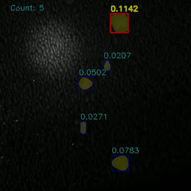

# ML-2-Segmentation
## Task
It is a real life industry task. [This video](https://homeassistant.bramble1.duckdns.org/local/clodding_train.avi) contains the outcome from a clodding machine. It grinds the soil or rocks and turns them into equally-sized clods, which are passed to the next step in the production chain. When the clodding machine malfunctions, it produces abnormally big clods which may damage the next machine and disable the entire chain.

Our task is to implement an online diagnostic system based on Computer Vision. The customer wants the system to

- Detect abnormal clods
- Estimate the number of them in each frame
- Estimate the size of the biggest one in the frame.

## Model and methods
We will solve this problem as semantic segmentation task. 
Model that will be used is [deeplabv3](https://pytorch.org/vision/main/models/deeplabv3.html) which can be used with torchvision library.

Important metric for our model is a speed, 
so we use [MobileNet](https://pytorch.org/vision/main/models/generated/torchvision.models.segmentation.deeplabv3_mobilenet_v3_large.html#torchvision.models.segmentation.deeplabv3_mobilenet_v3_large) 
as backbone model

Segmentation task includes only transformation image to mask. 
Separated clods are been detecting on postprocessing step.
If some clods stuck together they will be detected as one clod. Their separating 


## Prepare dataset

To prepare dataset you should do next steps:

1. Mark up your video in Label Studio. Use polygon segmentation for doing it
2. Load your mark-up json from Label Studio into `data/dataset/markup/` folder.
3. Load your video which was marked up into `data/dataset/markup/` folder. \
We think that your frames that were used for marking up, can be preprocessed. 
So, on our mind, it's better to extract source frames directly from video
4. Set split_k for data splitting (train and validation parts) in `src/config_and_utils/config.py`
5. From root of this project, run
    ```
    python -m src.cli prepare_dataset --movie_name=<your movie name>
    ```
   (or you can set movie_name in the config)
6. Your dataset will be named as current datetime `data/dataset/<datetime>`. 
It will consist of `train` and `val` parts with `x` and `y` folders


## Train
For train model, run next command from root of project (after dataset preparation)
```
python -m src.cli train
```
All parameters will be got from src.config_and_utils.config.TrainPipelineConfig 
but you can rewrite dataset path in command line:
```
python -m src.cli train --dataset=path/to/dataset
```

Model will be trained and put into `data/model` (by default)

Next table contains actual set of hyperparameters:

| *Hyperparameter*                               | *Value*                                                                                                                |
|------------------------------------------------|------------------------------------------------------------------------------------------------------------------------|
| Model                                          | deeplabv3                                                                                                              |
| Backbone                                       | MobileNet_V3_Large                                                                                                     |
| Loss function                                  | Binary Cross entropy + Intersection over union <br> (BCE + IoU)                                                        |
| Train metric <br> (used for choice best model) | Intersection over union (IoU)                                                                                          |
| Optimizer                                      | Adam                                                                                                                   |
| Learning rate                                  | 0.0001                                                                                                                 |
| Batch size                                     | 2                                                                                                                      |
| Number of epochs                               | 20                                                                                                                     |
| Image size                                     | (384, 384)                                                                                                             |
| Number of channels                             | 2 (includes background)                                                                                                |
| Random affine transformations                  | Rotates (-15 - 15 degrees), <br/>Translate (-30 - 30 pixels for each axis), <br/> Vertical Flip, <br/> Horizontal Flip |

Next table contains best values for loss and metrics:

| Train or Val  | Loss or Metric | Value |
|---------------|----------------|-------|
| Train         | Loss           | 0.28  |
|               | Metric         | 0.65  |
| Val           | Loss           | 0.26  |
|               | Metric         | 0.79  |


## Evaluate
For evaluating [prepare dataset](#prepare-dataset) and run
```
python -m src.cli evaluate
```
Or
```
python -m src.cli evaluate --dataset=path/to/dataset
```
Then check data/log_file.log to see `size MSE` and count `count MSE`. 
You should remember that MSE is a square of RMSE so if you get MSE equals 4 then
mean error is about 2.

Actual metrics:

| *Size MSE* | *Count MSE* |
|:----------:|:-----------:|
|   2.459    |    3.008    |


## Demo
Put your video file somewhere in project.
Setting demo in src/config_and_utils/config.py (class DemoPipelineConfig)
Run next command:
```
python -m src.cli demo [--video=<path to video>]
```
Will be started realtime demonstration. 
To speed up it set in config `size_type='model'` or increase `skip_frames` value.
30 frames per second can be achieved when `size_type` is 'model' and `skip_frames` is 5.

It means that stream will have the same size as our model uses, 
and mask will be created only for each 6th frame.

Demo looks like this gif:



## Sources
- [Torchvision](https://pytorch.org/vision/main/models.html) - helped to find and use pretrained model
- [Document Segmentation Using Deep Learning in PyTorch](https://learnopencv.com/deep-learning-based-document-segmentation-using-semantic-segmentation-deeplabv3-on-custom-dataset/#Custom-Training-Document-Segmentation-Model) - examples of training code, loss functions and metrics
- [ChatGPT](https://chat.openai.com/) - helped to write visualization code